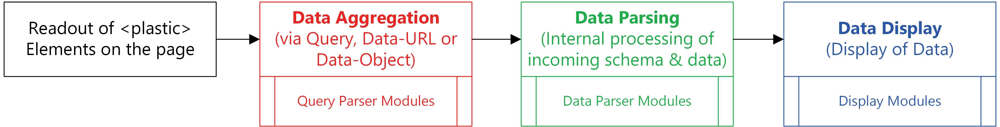
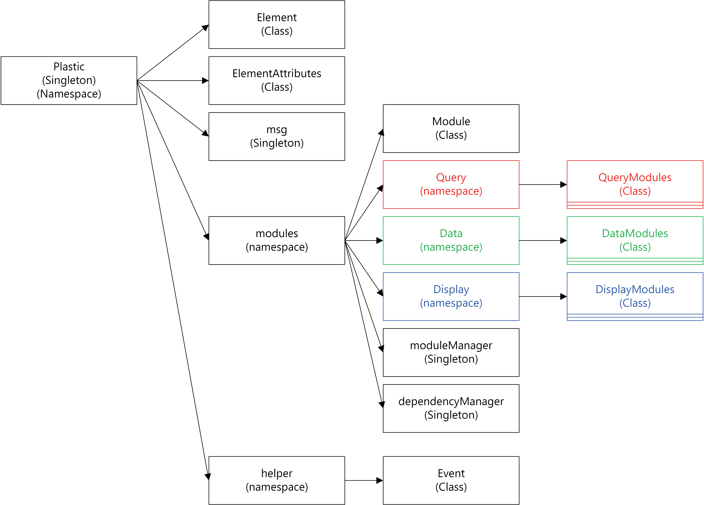

Application Architecture
========================

User perspective
----------------
From an user perspective the workflow of plastic.js could be reduced to a view like this:

Workflow
........
#. As you'll see plastic.js starts by looking for plastic.js elements on the page. If it finds any it starts a new process for each one.
   All the given attributes are read, validated and processed. If an error occurs, plastic.js gives feedback and eventually fails.

#. Depending on the usage of the plastic element, it starts with the query module which loads the data from an external datasource.

#. If no query is given or the query is completed, it starts right at the Data Parsing Module.
   This module interprets the incoming data (and schema) is and parses it into the internal data and data description format.

#. After that the Display Module renders the output depending on the internal data structure and data description.

Developer perspective
---------------------
plastic.js has an object oriented modular architecture.

